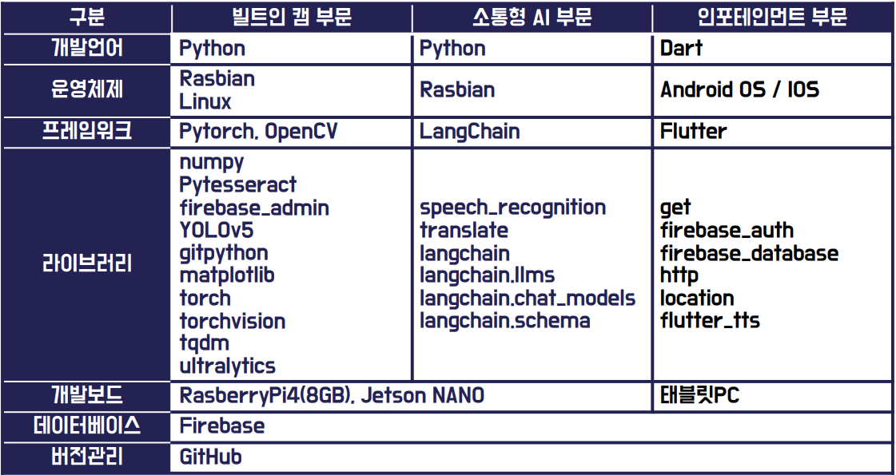

# 2024ESWContest_mobility_6013

## 빌트인 캠을 활용한 소통형 AI 커넥티드 카 플랫폼
- 운전자가 파악한 차량의 내·외부 상황을 소통형 AI를 활용하여 분석
- 분석한 데이터를 커넥티드 카 플랫폼을 통하여 다른 차량과 공유 가능
- 개인이 파악하지 못한 위험 상황을 커넥티드 카 플랫폼을 통하여 인지 

## 작품 설명
1. **작품**

2. **시스템 워크플로우**

3. **시스템 흐름도**
   

4. **시스템 구조**

5. **개발환경**

